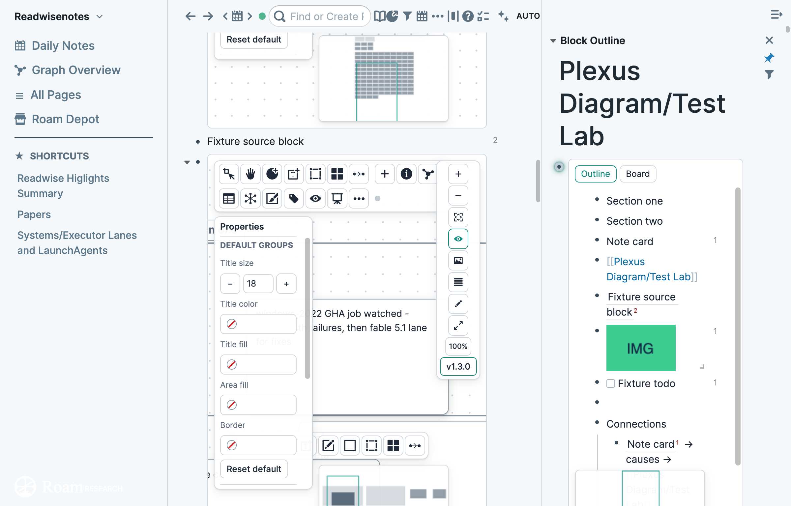
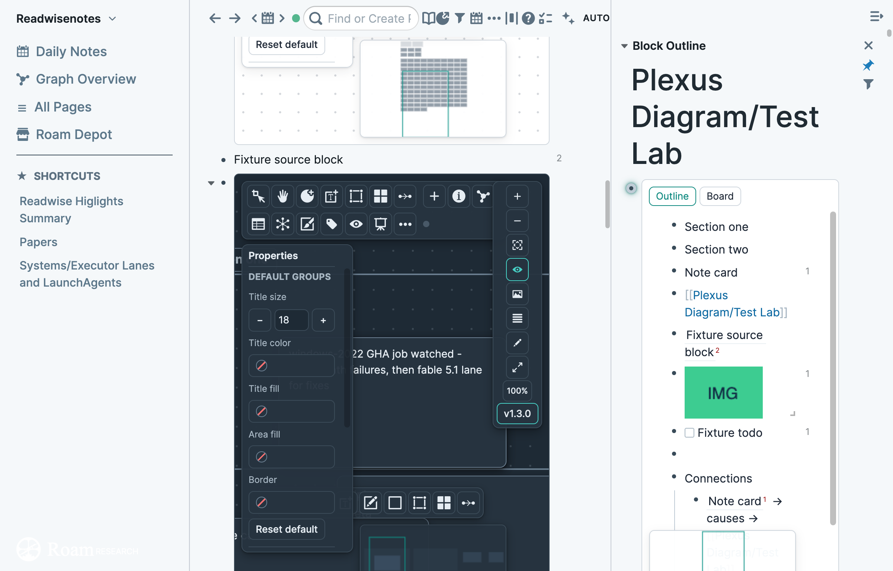

# Plexus Diagram

A Heptabase-style whiteboard for Roam `{{[[diagram]]}}` blocks. Cards, colored sections, and connections on an infinite canvas, where every object is a real Roam block: sections are parent blocks of their cards, connections are blocks that link both ends, and relationships already in your graph show up as arrows.

**Developer extension URL:** https://svyk.github.io/plexus-diagram

## Start a board

- **Every diagram opens as a Plexus board by default.** A new `{{[[diagram]]}}` block shows the board at once. Nothing is saved to the graph until you change the board; your first edit writes the board marker in the same undo step. A diagram that already has native shapes stays Roam's own, with an **Open as Plexus board** button over it that imports the shapes and arrows. **Plexus: Restore native diagram** now sticks, even with this on. Turn it off under Settings, **Every diagram is a Plexus board**, to open only diagrams you enhance or create with New whiteboard here.
- **Plexus: New whiteboard here** (palette or slash) creates `{{[[diagram]]:Untitled board}}` under the focused block and opens it.
- **Plexus: Commands…** (palette) lists every action and keeps the block that was focused: Enhance, Restore, Fullscreen, Export board as SVG, and Copy board as text. Slash still runs each action by its **Plexus:** name.
- **Plexus: Enhance this diagram** turns an existing native diagram into a board. Native node positions, groups (become sections), and edges (become connections) are imported. With Every diagram is a Plexus board off, native diagrams you never enhance are never touched.
- **Plexus: Restore native diagram** gives the block back to Roam's React Flow view. Content is not deleted.
- Opening a board's block page (zoomed in) shows it full screen. **Plexus: Fullscreen this diagram** does the same from anywhere.

Boards enhanced with 0.6 upgrade to the 1.0 format once, the first time they are opened.

## Surfaces

An enhanced board keeps Roam's diagram controls and adds to them (the 1.3 native set: the rail, Edit Block, the Properties panel, and the note-card hover).





- **Rail.** The vertical stack on the right (Settings can switch it to a horizontal bar): zoom in, zoom out, fit view, Toggle Minimap, Save PNG, Open outline in sidebar, Edit Block, Maximize, the zoom percent, and the version badge. Edit Block opens the diagram block's text. Esc returns to the board. The badge opens this version's changelog from the bundle. No network.
- **Properties.** The panel on the canvas. It edits the selection: text, title size, title color, title fill, area fill, fill, border, edges, and sections. Reset default clears that selection's overrides. Background, on the board, sets this board's pattern and tone.
- **Board bar.** The top row: breadcrumbs, Add, Info, graph links, Find, and More. The last breadcrumb and the bar's bottom edge take the board's own color. More holds export, templates, snapshots, background, dock position and a Views submenu (Gallery, Timeline, Graph); the same Views submenu is in the canvas right-click menu. Hovering any control shows a tooltip with its name, shortcut and a one-line description (Settings, Hover tooltips and Tooltip delay). A selection shows a context bar: colors, align, distribute, and, for a connection, direction, route, dash, weight, and label. Toolbar layout in Settings: Split (default, tools in the dock), Classic (tools in the top bar, as in 2.1), or Dock only (the bar appears when the pointer is near the top edge).
- **Panel.** Add opens the side panel, to the left of the rail. Search finds pages and blocks. Related lists what the selected card links to and what links to it. Info (also the I key) shows the card or the board. Boards lists saved views: a small map, Go, Copy ref, Rename, and Delete. Go restores the camera and writes nothing. The outline in the sidebar is the same canvas, not a second copy of the bullets.
- **Tool dock.** The floating bar along the bottom, above the minimap: Select (V), Hand (H), Card (N), Text (T), Sticky (S), Shape (R), Section (G), Board (W), Table (B), Connect (C). The active tool has a sliding highlight; double-click a tool to lock it (padlock). With Card, Sticky, Section or Shape active the dock shows that tool's options: with nothing selected a color, look or shape sets the next item you create (kept in memory only); with a selection it restyles the selection. Position, shape, labels and size are in Settings; a board can pick its own position from More, Dock position for this board. Below zoom 0.2 the dock keeps Select, Hand and Board. Hide it with Show tool palette.
- A note card is a plain block. Hover shows Color, Expand, and References.


## Using the board

| Do | How |
|---|---|
| Pan | Drag empty board with any of Select, Hand or Connect; trackpad scroll, Space + drag, middle-drag |
| Zoom | Pinch or Ctrl/Cmd + scroll, `−` / `+`, click the % to reset, Shift+1 fit all, Shift+2 fit selection |
| Select | Click; Shift-click to add; Shift-drag on empty board for a selection box (Settings, Drag on empty canvas: Select makes every empty drag a box); Alt-drag lasso; Cmd+A |
| New card | Double-click empty board, or N. Type right away; an empty new card disappears when you click away |
| Edit a card | Double-click or Enter. Roam's own editor opens in the card. A page card edits in place: same size and look, the cursor lands on the row you clicked, Esc returns to the same view. The card keeps its size while you edit, and its arrows stay attached; the editor fills the card and the card grows only if your text is taller. Esc to finish |
| Open | Click a `[[link]]` in a card to go there (Shift-click: sidebar). Context bar: Open in sidebar |
| Move / resize | Drag a card (from anywhere, links included); drag the right edge, bottom edge, or corner. Alignment guides snap to neighbours. The Hand tool moves cards and resizes too: drag a card to move it, a grip to resize, empty board to pan (Space-drag always pans). Page cards have a wide grip band and a corner above the scrollbar. Grips, connection dots and arrow-end handles keep the same size on screen at every zoom |
| Section | G, then drag (or click for a default size). Cmd+G wraps the selection. Drop cards in and out of sections. A section grows to contain a card moved or resized past its edge (24 px padding, cascading through nested sections); Fit to contents shrinks it, and Auto-fit in the menu turns it off for one section |
| Connect | Drag from a card's port (the dots on its edges) to another card or section. Drop on empty board to create a new linked card. C turns the whole card into a handle |
| Text | T for a free heading on the board (16/24/32/48) |
| Sticky notes | S, then click the board. A sticky is a real Roam block in a coloured note: drag the header bar to move it, click once in the note to type (tags, images, links, refs and the slash menu all work), drag a corner or edge to resize. The header has a colour dot (pick one of ten) and a minimize toggle that folds the note to its header; the choice is saved with the note. Stickies persist: there is no close button, and an empty sticky stays. Delete (or the menu) removes one, and Cmd+Z brings it back |
| Nested board | W, then click or drag; or select cards → **Move into new board**. Double-click a board card to go inside; the breadcrumb (`Parent › Child`) and Esc take you back up. Drag a card onto a board card to move it in |
| Drag from Roam | Drag any bullet from the outline or sidebar onto the board to add it as a `((ref))` card |
| Right-click menu | Right-click empty board, a card, section, text, connection, or a multi-selection. The board menu (toolbar More) has export, fold all, journals, background |
| Page cards | Add page… in the canvas menu searches for a page; dropping a page from the left sidebar does the same. A page card shows the title as a header (click opens the page, Shift-click the sidebar) and the whole outline, scrolling inside the card. Click a row to edit that block. A row that holds a board shows it as a small map with its title and item count (a one-line chip after four, and for the board you are on, "this board"); click opens it, Shift-click opens it in the sidebar. A row Roam cannot render shows its raw text. Roam's right sidebar title, links inside blocks and search results carry no drag data, so they cannot be dropped |
| Arrows to blocks | Drag an arrow end over a page card: the row under the pointer lights up and the arrow connects to that block with a `((ref))` (so it shows in Roam's backlinks); the title connects to the page. The end follows the row when the card scrolls and shows a marker at the edge when the row is out of view (click it to scroll there). Select an arrow to drag its end handles; the arrow menu has Connect to the page instead. The arrow continues into the card and its head stops beside the row; the row keeps a mark in the arrow's color. Hover either one and both light up; a row scrolled out of view becomes a pill at the card edge (click it to scroll back). |
| Journal | Panel tab Journal: the top-level blocks of a daily page, a day stepper and Today. Drag a row onto the board for a card. Viewing and stepping write nothing |
| Fullscreen tabs | Boards opened while fullscreen become tabs above the board bar, up to 9. Cmd/Ctrl+1 to 9 switch tabs; the list returns next time, per graph, stored on this device only |
| Touch | Pinch to zoom, two fingers to pan, long-press (half a second, still) for the menu, 44 px grips under a coarse pointer. Phones stay off with Disable on mobile |
| Highlighter colours | A card with `#bg-blue` or `#[[bg-blue]]` uses that colour when the colour highlighter is installed. A fill set on the card wins until you clear it. The colour picker's gear, Write as highlighter tag, stores one `#[[bg-name]]` in the block and clears the fill. One undo restores both. Hex, darker, and lighter stay on the card only. `#c:red` still colours text inside the card. |
| Card children | A card with child blocks shows only its own block and a ▸ N badge. Click the badge to open the children as an editable outline in the card (remembered per card); hover it to peek. The card menu has Spread children as cards: one card per child with an arrow back, in one undo step |
| Connections in Roam | A connection block (under a board's Connections) gets a small chip in the outline, the sidebar and linked references: "A —label→ B · on Board". Click it for a preview with a map of the two cards, the arrow and the target row; Open on board selects the connection (inside a nested board too), Open in sidebar opens the board block. Nothing is written The breadcrumb Roam draws above a connection block (in linked references and when zoomed into the block) opens the same preview on a plain click, with a ▦ mark; Shift, Cmd and Ctrl clicks keep Roam's behavior. The preview opens under the chip, else above or beside it, and never covers the chip or the block line |
| Duplicate | Alt+drag (Alt+Shift+drag makes `((ref))` cards) or Cmd+D |
| Copy / paste | Cmd+C, Cmd+V paste as `((ref))` cards, Cmd+Shift+V as copies (also from another board); pasted text becomes cards (bulk adds stop at 45 cards, so Roam's 50-change undo can reach them); pasted images upload and become cards |
| Move by keyboard | Arrows nudge the selection 1 px (Shift+Arrow 10 px); Alt+Arrow selects the nearest card in that direction (Alt+Shift+Arrow adds); Tab and Shift+Tab step through the outline order |
| Fold | Cmd/Ctrl+Alt+Enter folds or unfolds the selected cards |
| Pin | Pin (context bar or menu) locks a card, section, or text in place |
| Focus | F fades everything except the selection and its connections; Esc leaves |
| Quick look | Q shows the selected card and its children in an overlay |
| Present | P steps through the sections in outline order (arrows or Space, Esc to exit) |
| Mind map | M (Expand outline) on one note, block, or page card lays its children out as a mind map, up to 24 branches. The card menu has the same action |
| Background | The Background button picks a pattern (dots, lines, grid, plain) and a tone for this board; Use as default saves it for every board |
| Delete | Delete/Backspace. The toast offers Undo; Cmd+Z / Shift+Cmd+Z are Roam's own undo and redo |
| Search | `/` filters the board and steps through matches |
| Add | The Add panel searches pages and blocks, and its Related tab lists what the selected card links to and is linked from |
| Save view | More → Save view…, or Shift+V, stores the camera as one view block. With cards selected, the context bar saves a view of that selection. The Boards tab lists the views. Go restores the camera and writes nothing |
| Connection why | Double-click a label to set the label and a why note. Enter saves both. The outline chip adds because. Shift+T opens a memory lane. The links menu can suggest shared references. Plexus Commands can insert a resurface button. The command palette stays two entries |
| Public API | `window.PlexusDiagram` lists boards, opens a card or a saved view, adds one card, and returns a small PNG of a board. The command palette stays two entries |
| Roam Plexus on a board | A block ref of a Roam Plexus region shows the caption, a crop, Open drawing, and Open in sidebar. Without Roam Plexus the card is an ordinary block ref |
| Drawing on a board | A block ref of a Roam drawing shows the picture. Regions lists its regions and adds a reference. New drawing here creates the drawing and the reference. The drawing block stays where it is |

The context bar above a selection has 10 colors for cards, sections, text, and connections; connection direction (→ ↔ —), flip, route (curve, straight, elbow), dashed line, weight, label, and notes.

### What it means in Roam

| On the board | In the graph |
|---|---|
| Card | A child block of the board: a note (its own text and children), a `[[page]]`, a `((block))`, an image, or a nested `{{[[diagram]]:Title}}` board (its own cards are its children) |
| Section | A block whose children are its cards. Title it `[[Root cause]]` and the section, with its cards, appears in Root cause's linked references |
| Connection | A block under the board's collapsed **Connections** child, reading `[[Seal failure]] → causes → [[Leak]]`. Both ends get a backlink. Its children are notes on the connection |
| Graph links (dashed) | Existing references and attributes between cards on the board, drawn automatically and colored by relation. Toggle with **Links** (Off / Attributes / All) or L |
| Write to graph | On a labelled connection, writes the attribute to the source: `causes:: [[Leak]]` on page Seal failure (a child of the block for block cards). Existing blocks are never rewritten |
| Layout | Position, size, and color live in each block's hidden properties (`:block/props`), so they move with the block and undo with Roam's undo |
| Background | A board's pattern and tone are `bg` and `bgColor` in the board block's properties; without them the board uses the default from Settings |
| Pinned, fit | `pinned` on an item locks it; `fit:false` on a section opts it out of auto-fit. Both are properties on the block |
| Badges | The small counts on a card (references, boards, open and done TODOs) are read from Roam and never written |
| Pan and zoom | Stored per device in local storage. Opening, panning, and zooming write nothing to the graph |

## Regions and views

An image region and a saved view are blocks under `{{[[plexus-regions]]}}`. That container is a child of the image or the board. It is not a card.

| Kind | Block |
|---|---|
| Image region | `{{[[plexus-region]]: k=img d=<image uid> f=<rx>,<ry>,<rw>,<rh>}} caption` |
| Saved view | `{{[[plexus-region]]: k=view d=<board uid> v=<x>,<y>,<w>,<h>}} caption` |

`f` is the crop as fractions of the picture. `v` is the camera. `ids=` can name up to 24 cards. Roam Plexus 0.33.0 reserves these two kinds.

Mark a region on the picture, or from the block menu. Plexus copies a block ref. Paste that ref on a daily note and the crop shows there. Save view stores the camera the same way. The image card shows a region count. Rename changes only the words after `}}`. Delete asks when another block still references the region.

| Do | How |
|---|---|
| Mark region | On an image card, Mark region, then drag a rectangle on the picture. Confirm stores the region under the image and copies a block ref. The first undo removes the region. The next undo removes the empty container |
| Mark image region | On an image block, right-click the bullet, then Extensions, then Plexus: Mark image region. Drag a rectangle and Confirm. The region is stored under the image and a block ref is copied. Escape writes nothing. The same region shows as a crop, at most 160px tall, in the outline, a block ref, an embed, the sidebar, and linked references. The crop has a 1px border and no shadow |
| Open a region | Hover a crop for a larger preview. Click opens the image on its board, zoomed to the region, or scrolls the outline image into view and pulses the region. Shift-click opens the board in the sidebar |
| Open a view | An inline view is a small map. Hover enlarges it. Click opens the board at that view and pulses the highlighted cards. Shift-click opens the board in the sidebar. The click does not write |

## PDFs

Roam's reader does the highlighting. A pdf block on the board is a card. Plexus adds the cover, highlight cards, page chips, and a reading pane beside the board.

The card cover is the page image, first page or the last page you read, with a tick for each highlight. Open opens the reading pane. Its pill zooms, fits the width, and shows the page. Tools shows Roam's toolbar, and the drawer lists highlights so you can place one on the board.

| Do | How |
|---|---|
| PDF on a board | A pdf block is a card. The cover shows the file name and the highlight count. Open reader mounts Roam's reader. Interact uses that reader. One reader is open at a time. The command palette stays two entries |
| Highlight on a board | A block ref of a PDF highlight shows a colour bar, the passage or the area picture, and the page. Changing the colour tag updates the bar. A block that is not a highlight stays a normal ref. A child block under the highlight shows as its note |
| Open in reader | Opens a reading pane beside the board with Roam's reader and a list of the PDF's highlights (colour, page, note). Filter by colour, page or text. Place or drag a row to make a card, or drag a highlight straight out of the PDF onto the board; a highlight already on the board pulses. Clicking a row or a highlight card's footer scrolls the PDF to that highlight and flashes it. Closing the pane leaves the cards. The command palette stays two entries |
| Page chips | A PDF card has one chip per page. Click pulses the cards from that page. Double-click opens the page. An arrow into a highlight shows the page. The outline says On board. These do not write |
| Add highlights | On a PDF card, Add highlights lists that page's highlights by date, with a colour bar and a page number. Place as grid or column. One undo removes those cards. Drag a highlight's bullet onto the board for one card. Drop a date and confirm to add only its highlights. Paste of a highlight ref is unchanged |
| Highlight colour | The tag lens can keep one highlight colour bright. An area picture uses its saved width and height. Mark region on an area card stores the region under that highlight. The page mark keeps the colour Roam painted |

## Parse a PDF

Parse turns a PDF into text, headings, lists, tables and figures you can insert into Roam. Open the reading pane, then pick Parse. Read shows the PDF; Read + Outline puts the outline beside it (a narrow pane stacks them). The outline lists headings, tables, figures and formulas with their pages; search also finds paragraphs, and a heading row stands for its whole section when you insert, send, copy or drag. Nothing is written until you insert.

Read on the page itself:

| Gesture | What happens |
|---|---|
| Select text | A small bar appears under the selection, below Roam's own highlight tip: Copy, Card (a note card beside the PDF with the text and its page), Quote (the same as a blockquote), and a drag handle. Esc closes it. Roam's tip still makes the highlight |
| Drag a selection | Press inside the selection and drag, or drag the bar's handle. A card-shaped ghost follows the pointer, takes the board's zoom over the board with a dashed outline, and the card lands where the ghost is. Hold Alt as you drop for a quote. Esc or a drop outside the board keeps the selection |
| Drag a highlight | A highlight on the page or a row in the highlight list drags the same ghost and places the highlight card. Hold Shift on a list row for the browser's own drag, to drop into a Roam block |
| Scanned pages | Once a scanned page has been read (Read text, or Read the scan with the helper), its words become an invisible text layer on the page. Selecting, copying, the bar and Roam's own highlighter then work on the scan. The layer is kept on this device per PDF, not in your graph |

The built-in parser needs no install. It reads text, headings, lists, ruled and borderless tables with merged cells, figures, and formulas as crops. It follows two-column order and removes running headers and footers.

The optional local helper adds Docling for formulas as LaTeX and for OCR. For a scanned page, Read the scan runs Apple Vision word boxes through the same table engine. To use it:

| Step | How |
|---|---|
| Install | Open Engines (from the notice under the reader header, or the pane gear), press Set up, copy the command and run it in Terminal. It installs the helper and starts it at login |
| Pair | When the command says "Back to Roam: click Pair", press Pair. The token is stored for you; nothing is pasted. Pairing is open for 90 seconds, and `plexus-parse-helper pair` reopens it |
| Models | Press Download on the helper row. A bar shows progress, and Cancel keeps what is fetched |
| By hand | Run `plexus-parse-helper token` and paste the result into Advanced in Engines, or into Settings, Plexus Diagram, Parse helper token |
| Scans | Read the scan appears on scanned pages when the helper is ready. The outline's Read text button asks for the same reading |

An insert is one Roam write per table or page range, plus the card layout. Roam Grid tables keep merged cells when Roam Grid 0.18.3 or later is installed.

Measured on the 67 government PDFs of ICDAR 2013 and on a scanned CDC table. Details are in `docs/parse-bench.md`.

| Test | Built-in | Docling |
|---|---|---|
| ICDAR 2013, adjacency F1 | 0.979 | 0.865 |
| ICDAR 2013, cell F1 | 0.932 | 0.795 |
| ICDAR 2013, all 67 files | 2.5 s | 5 min |
| Scanned CDC 1980 table (image only), structure F1 | 1.000 | 0.821 |
| Scanned CDC 1980 table, cell F1 | 0.957 | 0.082 |

Label words in small scanned type can still be misread, so check a scanned table before you insert it.

## Office files and ebooks

Drop a Word, PowerPoint, Excel, OpenDocument, CSV, or EPUB file on the board, or choose Convert to cards on a file-link card. Plexus fetches that file only after the drop or the menu choice. Nothing is fetched when the board opens.

| File | What happens |
|---|---|
| PDF | Built-in engine, always |
| Scan | OCR source, then the same table engine |
| Word, Excel, PowerPoint, OpenDocument, CSV, EPUB | anydoc, when you drop the file or choose Convert to cards |
| PDF, other reading | anydoc only if you choose Alternative read in the Outline engine menu. The label says no tables guarantee |

A spreadsheet keeps the first 300 rows and says so. A long ebook or deck writes at most 45 blocks, then offers the next 45. An encrypted upload stays in Roam's reader.

## Tasks and statuses (opt-in)

The Task tool and Better Tasks start off. Turn them on under Settings → Integrations. A Task tool you already saved stays on. With both off, the dock has no Task button and K does nothing.

| Do | How |
|---|---|
| Tasks on the board | The Task tool and Better Tasks start off. Turn them on under Settings, Integrations. A Task tool you already saved stays on. With both off, the dock has no Task button and K does nothing. With them on, K, then click the board, makes a task card: a Roam `{{[[TODO]]}}` block. With Better Tasks loaded, the card shows its checkbox, its title and chips for due date, project, priority, repeat, status, waiting-for and GTD. Click the due, project, priority or repeat chip to change it from a small popover; the change is made by Better Tasks, so Plexus never writes a `BT_attr` block itself, and Cmd+Z after a chip change is Roam's undo, not the board's. Cmd+Z right after K removes the new block in one step. Today's due date gets a teal border, an overdue task a red one, a done task is dimmed and struck through. Tick the checkbox on the card (it is a light checkbox of Plexus's own, so a board of many tasks stays under Better Tasks' 100-checkbox limit) and Better Tasks writes the completed date and, for a repeating task, the next occurrence on its daily or project page; a toast offers Add to board. Zoomed out, a task is a check box of at least 20 screen pixels with its due date. Dragging a task card onto a daily-page card (or a section named for a day) sets that day as its due date, the same attribute block keeps its uid; hold Shift to move the card only. A Kanban drop on Done goes through the same Better Tasks checkbox, so a repeating task also makes its next occurrence. Popovers, the children peek and the card menu open clear of the dock, top bar, rail, minimap and panels. The card menu has Make task for a plain note card. Better Tasks' own attribute blocks and its activity log never show as rows, badges or children on a card. Without Better Tasks the tool still makes a plain TODO card and the chips are read-only |
| Task statuses | With Roam Task Status Tags 0.9.0+ loaded, a task card shows its status glyph on the checkbox and a status chip. The ring left of the checkbox opens the status chooser (Shift-click removes). Card menu and multi-select: Status ▸, at most 45 cards. Task Status Tags writes the tag; Plexus writes nothing. Kanban has Lanes: Status (columns per status, No status, Done; `[` `]` move a focused card) |

## Remembering

Lenses, trails, landmarks, the timeline, and resurface. Strength, Dust, the timeline, and card context are views: they read Roam and do not write the graph.

| Do | How |
|---|---|
| Trails | Card menu: Add to trail. Walk trail plays the stops in present mode with each stop's note. A trail is a block under the board's collapsed `Trails` child with `((card))` children in order; `((trail))` pasted anywhere in Roam shows a strip of stops you can click. Panel tab Trails lists them |
| Landmarks | Card menu: Make landmark. A landmark keeps a large glyph at every zoom (overview too) and shows on the minimap. Walk the board tours landmarks left to right, then down, or along a trail |
| Timeline | Info tab: the daily pages that mention a card on the board, with a count per day; click a day to open it. Lay out by date can use the first or last mention instead of a date attribute. Shift+T opens a memory lane |
| Strength and Dust | More menu. Strength thickens a connection whose ends are referenced a lot, share other boards and were edited recently (hover for the reason). Dust dims cards untouched for 6 months, 1 year or 2 years. Views only: nothing is written |
| Resurface | Allow the resurface macro from Settings → Integrations. A daily page lists cards from earlier days, and Plexus Commands can insert the button. The day list uses Resurface intervals (days, separated by commas) |
| Card context | Hover the info button to see when a card was made, the board, and cards from the same day. A block on a board shows a chip per board. Hover for a map. Click to open the card. These do not write |
| Source chip | A block dragged from an `Articles/` or `Media Captures/` page shows the page title and its `Author::`. Click to open the page in the sidebar |

## Works with

Plexus Diagram, Roam Compass, and Roam Plexus notice each other. Settings → Integrations shows which of these are detected, with versions.

| Integration | What it adds | Settings → Integrations |
|---|---|---|
| Better Tasks | Task chips (due, project, priority, repeat, status, waiting-for, GTD), the light checkbox, and task edits. Plexus never writes a `BT_attr` block. Off leaves the TODO marker to Roam. Without Better Tasks the Task tool still makes a plain TODO and the chips are read-only | Better Tasks integration. Off by default. Task tool is its own switch, off unless you already saved it on |
| Task Status Tags | The status glyph, the status chip, the ring chooser, and Kanban lanes by status. The extension writes the tag. Plexus writes nothing. `[` and `]` move a focused card between lanes | Status line only. No on/off switch |
| Roam Plexus | A region ref shows the caption, a crop, Open drawing, and Open in sidebar. A drawing ref shows the picture. New drawing here creates the drawing and the reference. An image card can start an empty drawing beside it. If Roam Plexus is missing, the card is an ordinary block ref and that menu row stays hidden | Roam Plexus and Compass, shared with Compass |
| Compass | A card menu can open Compass on that page, and Compass can open the board that holds it. If Compass is missing, that menu row stays hidden | Roam Plexus and Compass, the same switch. Off hides Open in Compass and stops thumbnail calls |
| Colour highlighter | A card with `#bg-blue` or `#[[bg-blue]]` uses that colour. A fill set on the card wins until you clear it. Write as highlighter tag stores one `#[[bg-name]]` and clears the fill. One undo restores both. Hex, darker, and lighter stay on the card. `#c:red` still colours text inside the card | Status line only. No on/off switch |

## Shortcuts

`?` opens this same list on the board. ⌘ means Command on a Mac and Ctrl elsewhere. Present keys apply only while a presentation is running. Arrow keys still nudge the selection 1 px, and Shift+arrows nudge 10 px. Trails, Tasks, and Regions rows are on the `?` sheet and are handled by that surface. They are not global shortcuts. K does nothing while the Task tool is off, and the `?` sheet hides that row then.

| Group | Keys | Action |
|---|---|---|
| Tools | V | Select |
| Tools | H | Hand |
| Tools | N | Card |
| Tools | K | Task |
| Tools | T | Text |
| Tools | S | Sticky |
| Tools | R | Shape |
| Tools | G | Section |
| Tools | W | Board |
| Tools | B | Table |
| Tools | C | Connect |
| Edit | Enter | Edit, open, or rename |
| Edit | F2 | Rename page |
| Edit | ⌘D | Duplicate |
| Edit | Delete | Delete |
| Edit | Shift+Delete | Delete with contents |
| Edit | ⌘Z | Undo |
| Edit | ⌘⇧Z | Redo |
| Edit | ⌘⌥Enter | Fold selection |
| Edit | ⌘G | Wrap in a section |
| Select | ⌘A | Select all |
| Select | Tab | Next in outline |
| Select | Shift+Tab | Previous in outline |
| Select | ⌥+arrows | Select nearest |
| Select | Shift+⌥+arrows | Add nearest |
| Select | Shift+F10 | Card menu |
| Select | M | Expand outline |
| View | Space | Hold to pan |
| View | ⌘+ | Zoom in |
| View | ⌘- | Zoom out |
| View | ⇧0 | Zoom to 100% |
| View | ⇧1 | Fit all |
| View | ⇧2 | Fit selection |
| View | Arrows | Nudge |
| View | Shift+arrows | Nudge by 10 |
| View | L | Cycle links |
| View | / or ⌘F | Find on board |
| View | I | Info |
| View | F | Focus |
| View | Q | Quick Look |
| View | P | Present |
| View | ? | Shortcuts |
| View | Shift+V | Save view |
| View | Shift+T | Memory lane |
| View | Escape | Close or step back |
| Navigate | ⌘[ | Back |
| Navigate | ⌘] | Forward |
| Navigate | ⌘1 | Board tab 1 |
| Navigate | ⌘2 | Board tab 2 |
| Navigate | ⌘3 | Board tab 3 |
| Navigate | ⌘4 | Board tab 4 |
| Navigate | ⌘5 | Board tab 5 |
| Navigate | ⌘6 | Board tab 6 |
| Navigate | ⌘7 | Board tab 7 |
| Navigate | ⌘8 | Board tab 8 |
| Navigate | ⌘9 | Board tab 9 |
| Present | → ↓ Space | Next |
| Present | ← ↑ | Previous |
| Trails | Alt+↑ / Alt+↓ | Reorder a trail stop |
| Trails | Enter | Walk from this stop |
| Tasks | [ | Previous status lane |
| Tasks | ] | Next status lane |
| Regions | Arrows | Nudge region 1 px |
| Regions | Shift+arrows | Nudge region 10 px |
| Regions | Enter | Confirm region |
| Regions | Esc | Cancel region |

## Limits

- Roam's undo stack holds 50 changes. A move of many cards, an align, a distribute, a paste, a mind map, and a template insert are each one undo step.
- A bulk add creates at most 45 cards, so that undo can still reach them.
- A mind map adds at most 24 branches.

### Writes and undo per gesture

Each row is the most writes one gesture makes, measured by `test/pol-2-writes.test.js`. A longer input stops at 45 writes and shows the undo-cap toast. One Roam undo step is one Cmd+Z. Mark region writes the regions container and the region as two steps when the image card has no container yet, and one step when that container is already there.

| Gesture | Writes (max) | Roam undo steps |
| --- | --- | --- |
| Mark region | 2 (≤ 3) | 2, or 1 if the container exists |
| Save view | 2 (≤ 2) | 1 |
| Add trail stop | 1, or 2 with a note | 1 |
| Add selection to trail | 45 (≤ 45) | 1 |
| New trail from a selection | 45 | 1 |
| Move a trail stop | 1 | 1 |
| Delete a trail | 1 | 1 |
| Place highlights | 45 per chunk (≤ 45) | 1 per chunk |
| Highlight note | 1 | 1 |
| Why | 1 | 1 |
| Landmark | 1 per item (≤ 45) | 1 |
| Status change | 0 by Plexus | 0 |
| Journal drag | 1 | 1 |
| Lay out by date | 45 | 1 |
| Source chip | 0 | 0 |
| Lenses and timeline viewing | 0 | 0 |
| Card or Quote from a PDF selection, or a dropped selection | 2 | 2 |
| Select, copy, drag preview, text layer | 0 | 0 |

## Settings

Settings → Extensions → Plexus Diagram. Each change applies on the open board. **Reset Plexus settings** puts every value back to its default.

| Group | Setting | What it does |
|---|---|---|
| Cards | Default card look | New note cards. Block is a plain Roam block. Card keeps a title row. |
| Cards | Default card width | Width of a new card, in pixels. |
| Cards | Default card height | Height of a new card, in pixels. |
| Cards | Enter in a card | Newline adds a line to the card's block, like a native Roam diagram. Child makes a new child block inside the card. |
| Cards | Show card badges | Show how many references, tasks, and children a card has. |
| Cards | Space out cards | After a move, push cards apart when they overlap. |
| Cards | PDF card cover | First page, or the last page read. First page is the default. |
| Cards | Prepare PDF covers in the background | On. A quiet board prepares a cover for a visible PDF that has none: Roam's PDF engine draws page 1 when it is reachable, otherwise a hidden reader does. |
| Cards | Highlight click opens | Reader (default) or Sidebar. Shift-click on a highlight card's chip always opens the sidebar; the chip's arrow lists Reader, Sidebar and Open page in main. |
| Cards | PDF pages in dark mode | Off, Dim, or Invert. Dim is the default. Applies when the board is dark, to the page canvas only, so highlight marks stay readable. Off keeps white pages. |
| Integrations | Better Tasks integration | Use Better Tasks for task chips, the light checkbox, and task edits. Off leaves the TODO marker to Roam. Starts off. |
| Integrations | Task tool | Show the Task tool (K) in the dock. Starts off. A saved on stays on. |
| Integrations | Task chips | Full (due date, project, priority, repeat, status), due only, or none. |
| Integrations | Default project for new tasks | A page name. A task made from the board gets it as its Better Tasks project. Empty uses Better Tasks' own default. |
| Integrations | Roam Plexus and Compass | Use Roam Plexus and Compass when they are loaded. Off hides Open in Compass and stops thumbnail calls. |
| Integrations | Board chips | Show a board chip under a block that is a card on a board. |
| Integrations | Resurface | Allow the resurface macro. A daily page can list cards from earlier days, and Plexus Commands can insert the button. |
| Integrations | Inline region crops | Show a region crop beside its button. Off leaves the button and hides the crop. |
| Sections | Auto-fit sections | Grow a section when a card is moved or resized past its edge. |
| Connections | Graph links | Show lines between cards that share a page reference or an attribute. All, attributes, or off. |
| Connections | Attribute styles | One JSON object. Each attribute name gets a palette color and a line: solid, dashed, or dotted. |
| Connections | Ask why on a new connection | After you draw a connection, open the why field. |
| Board | Enabled | Turn the diagram overlay on or off. |
| Board | Every diagram is a Plexus board | On: every `{{[[diagram]]}}` opens as a Plexus board. Nothing is saved until you change the board. Off: only diagrams you enhance (Plexus: Enhance) or create with New whiteboard open in Plexus. |
| Board | Fullscreen on zoom | Open a diagram full screen when you zoom into its block. Esc leaves it. |
| Board | Mouse wheel | Pan or zoom. Pinch still zooms. |
| Board | Drag on empty canvas | Pan moves the board when you drag empty space. Shift-drag draws a selection box. Select draws the box on every empty drag. |
| Board | Show minimap | Show the small map of the whole board. |
| Board | Show tool palette | Show the tool dock. |
| Board | Toolbar layout | Split: board bar on top, tools in the dock. Classic: the 2.1 look. Dock only: hide the top bar until the pointer is near the top edge. |
| Board | Tool dock position | Bottom, left or top. A board can override it from its More menu. |
| Board | Dock shape | Pill or strip. |
| Board | Show tool names under icons | Label each tool in the dock. |
| Board | Button size | Comfortable or compact, for both bars. |
| Board | Show tool options in the dock | Show the active tool's colors, look or shape next to the dock. |
| Board | Hover tooltips | Show a name, shortcut and one-line description when you hover or focus a control. Off falls back to the browser's plain tooltip. |
| Board | Tooltip delay | Instant, 350 ms or 800 ms. Keyboard focus always shows the tip at once. |
| Board | Controls | Rail is the vertical stack on the right. Bar is the horizontal zoom group. |
| Board | Snap guides | Line a dragged card up with its neighbours and show the guides. |
| Board | Snap to grid | Snap a dragged card to the 24 pixel grid. Hold Alt while dragging to skip snapping. |
| Board | Default board background: pattern | Dots, lines, grid, or plain, for boards that do not set their own. |
| Board | Default board background: tone | Color wash for boards that do not set their own. |
| Board | Canvas | Dots keeps the dot grid. Flat grey is a plain canvas, the Heptabase grey, with no grid. |
| Board | Section fill | None leaves a section as it is today. Pastel washes it with its colour. |
| Board | Highlight cards | Bar keeps the colour strip. Tint fills the card with the highlight colour and hides the strip. |
| Board | Theme | Follow Roam uses the colours of the open graph. Plexus keeps the slate board. |
| Board | Map view below (zoom) | Below 0.3, 0.45, or 0.6, cards show only their title. |
| Board | Enable shortcuts | Use keyboard shortcuts on the board. |
| Board | Show version badge | Show the version on the board. |
| Board | Resurface intervals | Days, separated by commas. A daily page lists cards from those many days ago. |
| Performance | Motion | Full, reduced, or none. A system reduced-motion setting shortens Full. |
| Performance | Disable on mobile | Do not open diagrams on a phone. |
| Performance | Collapse the outline | Fold an enhanced board once, so the outline does not list every card. Opening the bullet is remembered. |
| Performance | Speed log | Record open time, click-to-paint, pan frame rate, and long tasks in this tab. Nothing is sent or saved. |
| PDF parse | Parse helper address | Address of the local parse helper. The default is http://127.0.0.1:48765. Plexus calls it only when you parse. |
| PDF parse | Parse helper token | Secret from the helper's first start. Empty turns the helper off. Plexus sends it only to that address. |
| PDF parse | Default parse engine | Auto uses the built-in parser and offers Docling when the helper is ready. Built-in never calls the helper. Docling uses the helper. |
| PDF parse | Formula enrichment | Ask Docling to read formulas as LaTeX. Off leaves a formula as a crop. This is the slow part of a Docling parse. |
| PDF parse | Parse OCR | Auto lets the helper decide. On forces OCR. Off skips it. Scanned pages need OCR. |
| PDF parse | Auto-read scanned pages | Read the text of a scanned page as soon as you open it, once the reading models are on this device. Off waits until you press Read text. |
| PDF parse | Safe links when inserting | Wrap [[pages]], ((blocks)), {{macros}}, #tags and Name:: so a parsed insert does not create pages. On by default. |
| PDF parse | Numbered lists when inserting | On writes ordered lists with Roam's 1. syntax. Off keeps the original number as text on a bullet. |
| PDF parse | Footnotes | Inline places each note after the paragraph that cites it. End places every note after the insert. |
| Performance | speed-flags | Hidden. Not a panel row. A JSON object, parsed by parseSpeedFlags. |

## Privacy

No network requests. All reads and writes go through Roam's extension API on your graph.

## Development

```bash
npm ci --ignore-scripts --no-audit --no-fund
npm run check
```

Design: `docs/spec-plexus-1.0.md`, `docs/spec-plexus-1.2.md`, and `docs/spec-plexus-3.0.md`. Module contracts: `docs/api-plexus-1.0.md`, `docs/api-plexus-2.0.md`, and `docs/api-plexus-3.0.md`. Commit `src/` with the generated root `extension.js` / `extension.css` and `deploy/`.

## Install

Roam: **Settings → Roam Depot → Developer extensions → Load extension → URL** → `https://svyk.github.io/plexus-diagram`.

To update, remove that URL and add it again. The page serves the latest build from `main`. An open tab keeps the old bundle until you do that.

## License

[MIT](LICENSE)
