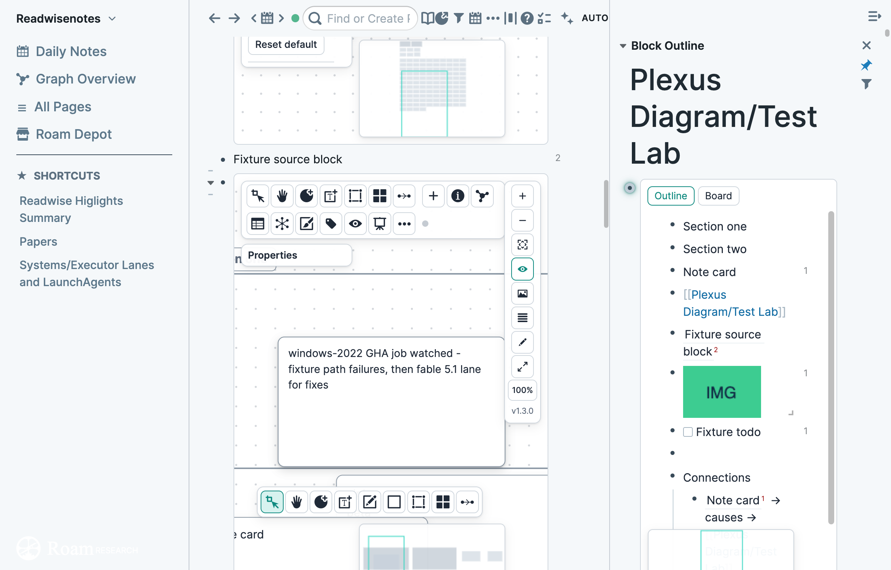

# Depot listing draft

This folder is the Roam Depot material for Plexus Diagram. Nothing here is read at runtime. The pull request against `Roam-Research/roam-depot` has not been opened.

## Description

Plexus Diagram is a whiteboard on a Roam `{{[[diagram]]}}` block. A card, a section, and a connection are ordinary blocks. Graph links already in the graph draw as dashed arrows. Restore native diagram hands the block back to Roam's own diagram view.

The product page Roam renders is the repository `README.md` at `source_commit`. The short line in the metadata file is the marketplace blurb.

## Screenshots

These are the Test Lab fixture shots already in `docs/img/`.




## Metadata

`extensions/Svyk/plexus-diagram.json` is the file a fork would place at `extensions/Svyk/plexus-diagram.json`.

| Field | Value |
|---|---|
| name | Plexus Diagram |
| author | Svyatoslav Kleshchev |
| source_url | https://github.com/Svyk/plexus-diagram |
| source_repo | https://github.com/Svyk/plexus-diagram.git |
| source_commit | `fea90ba1e2bbb4c9f3d1f2687a10443454f6a1b0` |
| tags | diagram, whiteboard, canvas, blocks |

`source_commit` is `origin/main` on 2026-10-02 (`docs(P7/UI-9): tick the changelog popover`). That is the commit a reviewer can fetch today. The annotated tag `v1.3.0` is `00841d5cc9d00b4232e9735cc2c27c5ebb6ac79f`. Local `main` is ahead of `origin/main` and has not been pushed. Replace `source_commit` with the SHA on GitHub before opening the pull request.

## Pull request

Title: `Add Plexus Diagram`

Body:

```
Add extensions/Svyk/plexus-diagram.json.

Source: https://github.com/Svyk/plexus-diagram
Commit: fea90ba1e2bbb4c9f3d1f2687a10443454f6a1b0
```

Fork `Roam-Research/roam-depot`, copy the JSON to `extensions/Svyk/plexus-diagram.json`, and open that pull request only when you decide to. This draft does not do that.

## What the reviewer will build

`build.sh` runs `npm ci --ignore-scripts --no-audit --no-fund` and then `node build.mjs`. The repo root has `README.md`, `extension.js`, `extension.css`, `CHANGELOG.md`, and `LICENSE` (MIT). The Depot draft was written against package 1.3.0. The tagged release is 2.0.0.

Phase gates P2 through P7 are still blocked. This draft does not treat the listing as a release.
